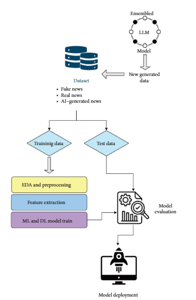

The proliferation of fake online and AI–generated news content poses a significant threat to information integrity. This work leverages advanced natural language processing, machine learning, and deep learning algorithms to effectively detect fake and AI–generated content. The utilized dataset, combined with multiple open‐source datasets, comprises 43,000 real, 31,000 fake, and 80,000 AI–generated news articles and is augmented with an ensemble large language model. We combined three open‐source LLMs (GPT‐2, GPT‐NEO, and Distil‐GPT‐2) into an ensemble LLM to generate new news titles, selecting the best outputs through majority voting for further dataset expansion. Preprocessing involved data cleaning, lowercasing, stop word removal, tokenization, and lemmatization. We applied six machine learning and five natural language processing models to this dataset. The two top‐performing natural language–based models (RoBERTa and DeBERTa) have been combined to develop an ensemble transformer model. Among the machine learning models, random forest achieved the highest performance, with an accuracy of 92.49% and an F1 score of 92.60%. Among the natural language processing models, the ensemble transformer model attained the highest results, with 96.65% accuracy and an F1 score of 96.66%. The proposed ensemble model is optimized by applying model pruning (reducing parameters from 265M to 210M, improving training time by 25%) and dynamic quantization (reducing model size by 50%, maintaining 95.68% accuracy), enhancing scalability and efficiency while minimizing computational overhead. The DistilBERT‐Student model, trained using a balanced combination of feature‐ and logit‐based distillation from the RoBERTa‐base Teacher network, achieved strong classification performance with 96.17% accuracy. Visualize‐based attention maps are constructed for different news categories to enhance the interpretability of the applied transformer–based ensemble news detection models. Finally, a website was developed to enable users to identify fake, real, or AI–generated news content. 

